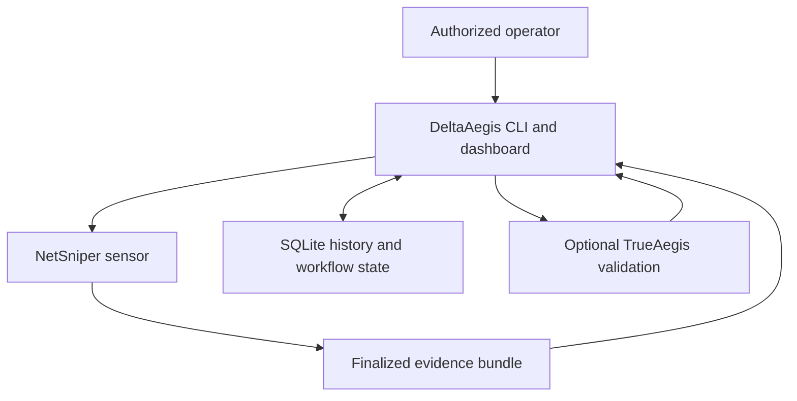
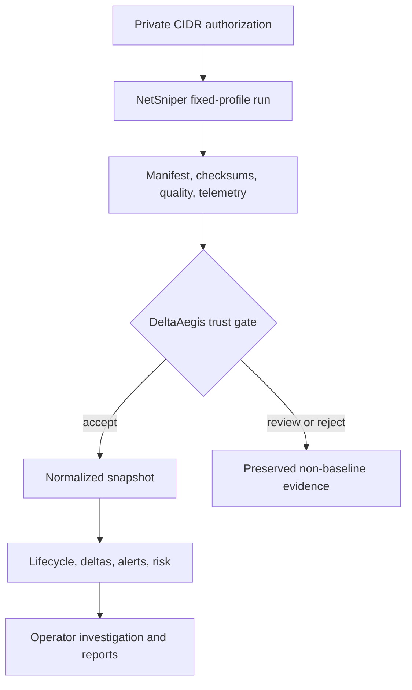

# DeltaAegis Architecture Overview

Status: v1.0 combined Stage 3–5 candidate on the released v0.45.0 baseline

## System role

DeltaAegis is the durable history, comparison, investigation, orchestration, and reporting layer between NetSniper telemetry and an operator. It is a single deployable standard-library Python application backed by SQLite, with a repository-root compatibility facade and an internal modular core package. TrueAegis is an optional defensive validation producer.

## Current repository components

| Component | Current owner | Responsibility | Must not own |
|---|---|---|---|
| CLI and application dispatch | `deltaaegis.py` | Argument parsing, command dispatch, human/JSON output | Sensor implementation or arbitrary shell execution |
| Configuration and paths | `deltaaegis_core/config.py`, root facade, environment variables, launchers | Local roots, database, reports, logs, sensor paths | Secrets in source or caller-controlled filesystem escape |
| Storage and migrations | `deltaaegis_core/db.py`, `deltaaegis_core/migrations.py`, root-owned migration declarations | SQLite connection policy, ordered checksummed forward migrations, verified pre-migration backup, row serialization | Unledgered mutation, downgrade SQL, or remote/symlinked active databases |
| NetSniper ingest | `deltaaegis_core/ingest.py` behind the root facade | Bundle discovery, trust checks, normalization, acceptance | Treating conclusions as raw observations |
| Delta and lifecycle engine | `deltaaegis.py` | Snapshot comparison, events, alerts, lifecycle | Cross-scope identity assumptions after sensor identity exists |
| Sites and scope aggregation | `deltaaegis_core/sites.py` behind the root facade | Logical groupings and site-wide read aggregation | Replacing technical scope identity |
| Authentication and authorization | `deltaaegis_core/auth.py` behind the root facade | Users, passwords, sessions, tokens, RBAC, access audit | Browser-supplied actor or privilege |
| Jobs and schedules | `deltaaegis_core/jobs.py` for durable policy; root facade for process orchestration | Durable state, fixed-argv process launch, cancellation, watchdog, recovery | Direct browser PID signaling or arbitrary command strings |
| Stable API contract | `deltaaegis_core/api_v1.py`, `contracts/v1/openapi.json` | Versioned endpoint inventory, OpenAPI 3.1, envelopes, pagination, request identity, idempotency | Private dashboard compatibility routes or sensor implementation |
| Sensor/scope identity | `deltaaegis_core/identity.py` | Enrollment, deterministic scope identity, evidence receipts, scoped current state, overlap isolation | Logical-site inference or cross-scope asset merging |
| Detection results | `deltaaegis_core/detection.py` | Versioned rules, immutable deterministic results, provenance, separate reviews | Autonomous response or rewriting source evidence |
| Operational state | `deltaaegis_core/operations.py` | Liveness, readiness, diagnostics, integration pins, performance/soak contracts | Raw secrets or unbounded diagnostic output |
| Dashboard HTTP/UI | `deltaaegis_core/web.py` behind the root facade | Local HTTP server, HTML/JS, stable and private JSON handlers, authentication transport, operator workflows | Domain policy or caller-supplied authority |
| Reports and backups | `deltaaegis_core/reports.py` for queries/Markdown; root facade for file output and backups | Markdown reports, SQLite backups, manifests, rehearsal, cutover | Silent overwrite or unverified restore |
| Troubleshooter | `tools/deltaaegis_troubleshooter.py` | Read-mostly diagnostics and bounded repair guidance | Hidden mutation of active evidence |
| Validation estate | `tools/validate_*` | Release contracts and predecessor compatibility | Unowned duplicate execution graphs |

The repository-root facade remains deliberately compatible with historical imports and validators, but configuration, database connection policy, migrations, authentication, stable API contracts, ingest, Sites, durable Jobs policy, Reports, and dashboard web ownership now live in explicit internal modules. Remaining root-owned lifecycle, migration declarations, backup implementation, and process-orchestration responsibilities stay mapped work rather than permission for a broad rewrite.

## Runtime process model

1. A CLI invocation opens one configured SQLite database, performs a bounded command, commits explicit state changes, and exits.
2. The dashboard starts one local HTTP server. It defaults to loopback and requires explicit guarded configuration for LAN binding.
3. Dashboard scan/schedule/validation work is represented by durable database rows and executed by controlled worker threads or fixed-argument child processes.
4. NetSniper and TrueAegis run as separate local processes. DeltaAegis never imports them as privileged in-process libraries.
5. Worker completion, heartbeat, cancellation, watchdog, and schedule reconciliation evidence is persisted so restart recovery does not depend only on memory.

## Storage model

SQLite is the authoritative application store through v1.0. Major domains are:

- accepted and review-required scan snapshots;
- normalized assets, services, findings, and classification evidence;
- lifecycle state, delta events, alerts, notes, and annotations;
- investigation tickets and history;
- scan, schedule, deletion, and TrueAegis job evidence;
- logical sites and technical-scope memberships;
- users, sessions, API tokens, and access audit;
- ordered schema-migration evidence and durable stable-API idempotency records;
- enrolled sensors, deterministic technical scopes, evidence receipts, and scoped current-state heads;
- immutable detection results plus a distinct append-only review/suppression ledger;
- validation observations and correlations;
- backup, restore, and release-validation evidence held in files or database rows as their contracts require.

Foreign-key enforcement is mandatory. Active databases must be local files. Backup and restore logic accounts for SQLite sidecars and uses SQLite-consistent copies.

## Evidence flow and trust boundaries

Trust rules:

- The operator authorizes private scan scope; neither a browser payload nor a bundle may expand it.
- A manifest is untrusted input until path confinement, finalization, checksum, profile, and readiness checks pass.
- Only accepted snapshots advance stable lifecycle state.
- Authentication identity and audit actor come from the authenticated server-side session or token.
- Browser HTML and JSON are untrusted transport. Authorization is enforced again at the route/action boundary.
- TrueAegis results remain imported evidence and do not rewrite raw NetSniper observations.

## Current API and operations boundary

The combined v1 candidate exposes the stable `/api/v1` boundary defined by `deltaaegis_core/api_v1.py` and the tracked OpenAPI 3.1 artifact at `contracts/v1/openapi.json`. Programmatic clients use bounded, scoped `Authorization: Bearer` credentials. Browser sessions use same-origin double-submit CSRF for every mutation. Stable mutations are transactionally idempotent, and stable responses use versioned success/error envelopes plus request IDs. Public health is deliberately minimal; readiness and diagnostics require the ADMIN-only `operations.read` scope.

The dashboard's pre-existing unversioned `/api/*` endpoints remain authenticated private compatibility interfaces. They are not promoted into the stable contract, and the legacy `X-DeltaAegis-Token` transport cannot authenticate `/api/v1`.

## v0.44 modular boundary result

Extraction was completed incrementally behind characterization and predecessor-compatibility tests. The resulting ownership map is:

| Target package | First responsibility moved | Compatibility seam |
|---|---|---|
| `deltaaegis_core/config.py` | Defaults and path resolution | Root-module constants and CLI defaults |
| `deltaaegis_core/db.py` | Low-level connection policy | Existing `connect` behavior and root-owned schema bootstrap |
| `deltaaegis_core/auth.py` | Passwords, users, sessions, tokens, RBAC | Existing function signatures and audit rows |
| `deltaaegis_core/ingest.py` | Bundle trust and normalization | Existing ingest receipts and fixtures |
| `deltaaegis_core/sites.py` | Site storage and scope aggregation | Existing CLI/API payloads |
| `deltaaegis_core/jobs.py` | Scan, schedule, watchdog, cancellation, finalization | Existing durable status transitions |
| `deltaaegis_core/reports.py` | Report queries and Markdown generation | Existing report sections and output |
| `deltaaegis_core/web.py` | HTTP routing, response boundaries, server lifecycle | Rendered DOM/JS and HTTP smoke tests |

The repository-root `deltaaegis.py` remains the executable and import
compatibility facade.  ADR 0010 records why the internal package cannot be
named `deltaaegis` while that facade exists.

The completed extraction did not mix functional redesign with file movement. Each moved responsibility retains its existing validator coverage, public facade, and frozen behavior evidence. The v1 transition adds `api_v1`, `current_state`, `migrations`, and `telemetry_quality` as explicit additive modules without removing the eight characterized v0.44 modules.

Stages 1–8 now implement the configuration, connection-policy, authentication,
NetSniper ingest, Sites, durable Jobs policy, Reports, and dashboard web boundaries shown above. The root module intentionally retains
thin functions with the established names and signatures; downstream imports
and historical validators therefore continue to use the same public surface.

## Architecture decision index

- ADR 0001 — SQLite storage boundary
- ADR 0002 — Forward-only migration framework
- ADR 0003 — Stable `/api/v1` contract
- ADR 0004 — Sensor, scope, and asset identity
- ADR 0005 — Authentication and web security
- ADR 0006 — Durable job execution
- ADR 0007 — Backup, restore, and upgrade recovery
- ADR 0008 — Compatibility and integration contracts
- ADR 0009 — Versioning and deprecation
- ADR 0010 — Internal package and compatibility facade

## Known architecture debt

The reproducible inventory and disposition are maintained in `docs/repository-audit.md`. Stages 1–2 close unledgered upgrades, recovery, and the stable API/security gap. Stages 3–5 close the durable identity, deterministic detection, readiness/diagnostics, integration-pin, and measured performance implementation gaps. The root facade size and validator estate remain tracked maintainability debt. The 24-hour release-evidence soak and final blocker review remain operational release gates, not missing runtime features.
## v0.45 telemetry-trust boundary

DeltaAegis evaluates every finalized NetSniper bundle before operational
mutation. The decision runtime separates immutable automated state from audited
reviewed state, retains trusted/quarantined evidence in managed storage, and
projects operational current state from `ACCEPTED` plus positive-only
`DEGRADED` evidence. `QUARANTINED` and `REJECTED` bundles cannot mutate active
assets, services, findings, alerts, events, or risk.

The Telemetry Quality Center is an operator surface at
`/operator/telemetry-quality`. NetSniper remains the CLI/headless sensor and
does not receive a dashboard or DeltaAegis policy logic.

The v0.45 telemetry-trust storage boundary initializes lazily on first feature
use so ordinary database connection startup preserves the v0.44 characterized
table inventory.

## v1 Stage 1–5 boundary

Every database connection now enters through the ordered migration manager.
Supported unledgered v0.42–v0.45 databases are recognized by exact schema
fingerprint, backed up and verified while holding a SQLite write reservation,
then advanced through one migration and ledger row per transaction. Fresh
databases converge on the same schema without a needless legacy backup.
Unknown origins, checksum drift, ledger gaps, symlinks, and known remote
filesystems fail closed. Recovery remains an explicit verified restore rather
than reverse migration SQL.

The stable API is additive: it calls existing domain functions and does not
duplicate storage ownership. OpenAPI, runtime routing, authorization scopes,
and validator inventories derive from the same endpoint declarations. A
tracked contract artifact must equal runtime generation. The real-HTTP gate
exercises credential isolation, role and scope caps, revocation, CSRF,
authority validation, security headers, request bounds, error envelopes, and
concurrent idempotency against temporary SQLite state.

Migration 0004 assigns every supported legacy row to an explicit default
sensor and deterministic or unassigned scope. Managed sensors may reuse the
same private CIDR because scope identity binds the CIDR to `sensor_id`.
Receipts bind source scan IDs to bundle digests; conflicts and unknown sensors
fail closed, older evidence cannot roll a scope head backward, and active scan
reservation is one per sensor.

Migration 0005 creates immutable detection results whose IDs include rule
version, scope, scan, subject, and canonical evidence. Explanation and source
provenance are stored with the result. Operator review, suppression, and
unsuppression are append-only records and never rewrite the result.

Stage 5 adds minimal liveness, authenticated readiness, secret-redacted
diagnostics, pinned integration contracts, low-resource/failure fixtures,
reproducible v0.43-derived thresholds, and a separate 24-hour soak receipt.
This candidate is not v1.0 GA until that soak and the final blocker audit pass.
