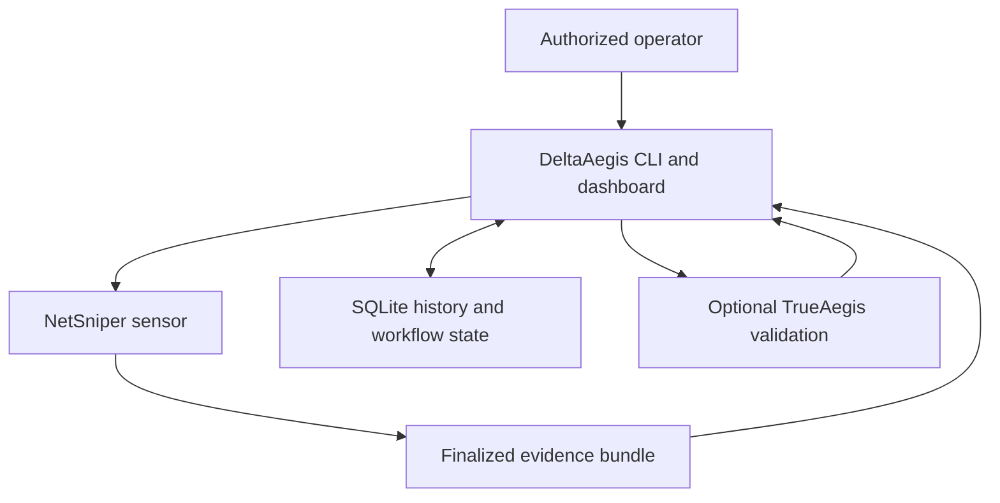

# DeltaAegis Architecture Overview

Status: v0.43.0 current-state map and v1.0 extraction baseline

## System role

DeltaAegis is the durable history, comparison, investigation, orchestration, and reporting layer between NetSniper telemetry and an operator. It is currently a single Python application backed by SQLite. TrueAegis is an optional defensive validation producer.

## Current repository components

| Component | Current owner | Responsibility | Must not own |
|---|---|---|---|
| CLI and application dispatch | `deltaaegis.py` | Argument parsing, command dispatch, human/JSON output | Sensor implementation or arbitrary shell execution |
| Configuration and paths | `deltaaegis.py`, environment variables, launchers | Local roots, database, reports, logs, sensor paths | Secrets in source or caller-controlled filesystem escape |
| Storage and schema bootstrap | `deltaaegis.py` `SCHEMA_SQL`, `connect`, additive helpers | SQLite schema, compatibility additions, row serialization | Untracked destructive migrations |
| NetSniper ingest | `deltaaegis.py` | Bundle discovery, trust checks, normalization, acceptance | Treating conclusions as raw observations |
| Delta and lifecycle engine | `deltaaegis.py` | Snapshot comparison, events, alerts, lifecycle | Cross-scope identity assumptions after sensor identity exists |
| Sites and scope aggregation | `deltaaegis.py` | Logical groupings and site-wide read aggregation | Replacing technical scope identity |
| Authentication and authorization | `deltaaegis.py` | Users, passwords, sessions, tokens, RBAC, access audit | Browser-supplied actor or privilege |
| Jobs and schedules | `deltaaegis.py` | Durable state, fixed-argv process launch, cancellation, watchdog, recovery | Direct browser PID signaling or arbitrary command strings |
| Dashboard HTTP/UI | `deltaaegis.py` | Local HTTP server, HTML/JS, JSON handlers, operator workflows | A stable public API until `/api/v1` is introduced |
| Reports and backups | `deltaaegis.py` | Markdown reports, SQLite backups, manifests, rehearsal, cutover | Silent overwrite or unverified restore |
| Troubleshooter | `tools/deltaaegis_troubleshooter.py` | Read-mostly diagnostics and bounded repair guidance | Hidden mutation of active evidence |
| Validation estate | `tools/validate_*` | Release contracts and predecessor compatibility | Unowned duplicate execution graphs |

The current single-file organization is deliberate historical accumulation, not the v1.0 target. Late function redefinitions and appended compatibility layers make source order significant. v0.43 records that risk; v0.44 performs incremental extraction behind compatibility tests.

## Runtime process model

1. A CLI invocation opens one configured SQLite database, performs a bounded command, commits explicit state changes, and exits.
2. The dashboard starts one local HTTP server. It defaults to loopback and requires explicit guarded configuration for LAN binding.
3. Dashboard scan/schedule/validation work is represented by durable database rows and executed by controlled worker threads or fixed-argument child processes.
4. NetSniper and TrueAegis run as separate local processes. DeltaAegis never imports them as privileged in-process libraries.
5. Worker completion, heartbeat, cancellation, watchdog, and schedule reconciliation evidence is persisted so restart recovery does not depend only on memory.

## Storage model

SQLite is the authoritative application store through v1.0. Major domains are:

- accepted and review-required scan snapshots;
- normalized assets, services, findings, and classification evidence;
- lifecycle state, delta events, alerts, notes, and annotations;
- investigation tickets and history;
- scan, schedule, deletion, and TrueAegis job evidence;
- logical sites and technical-scope memberships;
- users, sessions, API tokens, and access audit;
- validation observations and correlations;
- backup, restore, and release-validation evidence held in files or database rows as their contracts require.

Foreign-key enforcement is mandatory. Active databases must be local files. Backup and restore logic accounts for SQLite sidecars and uses SQLite-consistent copies.

## Evidence flow and trust boundaries

```mermaid
flowchart TD
    A["Private CIDR authorization"] --> B["NetSniper fixed-profile run"]
    B --> C["Manifest, checksums, quality, telemetry"]
    C --> D{"DeltaAegis trust gate"}
    D -->|accept| E["Normalized snapshot"]
    D -->|review or reject| F["Preserved non-baseline evidence"]
    E --> G["Lifecycle, deltas, alerts, risk"]
    G --> H["Operator investigation and reports"]
```

Trust rules:

- The operator authorizes private scan scope; neither a browser payload nor a bundle may expand it.
- A manifest is untrusted input until path confinement, finalization, checksum, profile, and readiness checks pass.
- Only accepted snapshots advance stable lifecycle state.
- Authentication identity and audit actor come from the authenticated server-side session or token.
- Browser HTML and JSON are untrusted transport. Authorization is enforced again at the route/action boundary.
- TrueAegis results remain imported evidence and do not rewrite raw NetSniper observations.

## Current API boundary

The dashboard uses unversioned `/api/*` endpoints implemented by the local handler in `deltaaegis.py`. They are authenticated implementation endpoints, not yet a stable third-party contract. ADR 0003 reserves `/api/v1` for the stable API introduced in v0.46.

## v0.44 extraction map

Extraction must be incremental and behavior-preserving. The intended ownership map is:

| Target package | First responsibility moved | Compatibility seam |
|---|---|---|
| `deltaaegis_core/config.py` | Defaults and path resolution | Root-module constants and CLI defaults |
| `deltaaegis_core/db.py` | Low-level connection policy | Existing `connect` behavior and root-owned schema bootstrap |
| `deltaaegis_core/auth.py` | Passwords, users, sessions, tokens, RBAC | Existing function signatures and audit rows |
| `deltaaegis_core/ingest.py` | Bundle trust and normalization | Existing ingest receipts and fixtures |
| `deltaaegis_core/sites.py` | Site storage and scope aggregation | Existing CLI/API payloads |
| `deltaaegis_core/jobs.py` | Scan, schedule, watchdog, cancellation, finalization | Existing durable status transitions |
| `deltaaegis_core/reports.py` | Report queries and Markdown generation | Existing report sections and output |
| `deltaaegis_core/web.py` | HTTP routing, response boundaries, server lifecycle | Rendered DOM/JS and HTTP smoke tests |

The repository-root `deltaaegis.py` remains the executable and import
compatibility facade.  ADR 0010 records why the internal package cannot be
named `deltaaegis` while that facade exists.

No extraction should mix functional redesign with file movement. A moved responsibility retains its existing validator coverage before cleanup begins.

## Architecture decision index

- ADR 0001 — SQLite storage boundary
- ADR 0002 — Forward-only migration framework
- ADR 0003 — Stable `/api/v1` contract
- ADR 0004 — Sensor, scope, and asset identity
- ADR 0005 — Authentication and web security
- ADR 0006 — Durable job execution
- ADR 0007 — Backup, restore, and upgrade recovery
- ADR 0008 — Compatibility and integration contracts
- ADR 0009 — Versioning and deprecation
- ADR 0010 — Internal package and compatibility facade

## Known architecture debt

The reproducible inventory and disposition are maintained in `docs/repository-audit.md`. The highest-risk items are the monolithic source boundary, late top-level function redefinitions, inline storage/API/UI ownership, stale historical architecture prose, and the size of the validator estate. These are mapped work, not authorization for a broad v0.43 rewrite.
